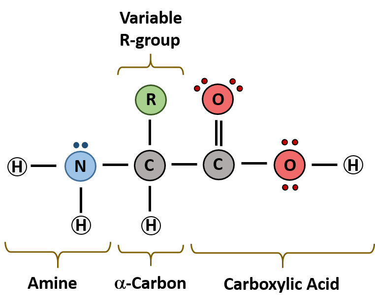
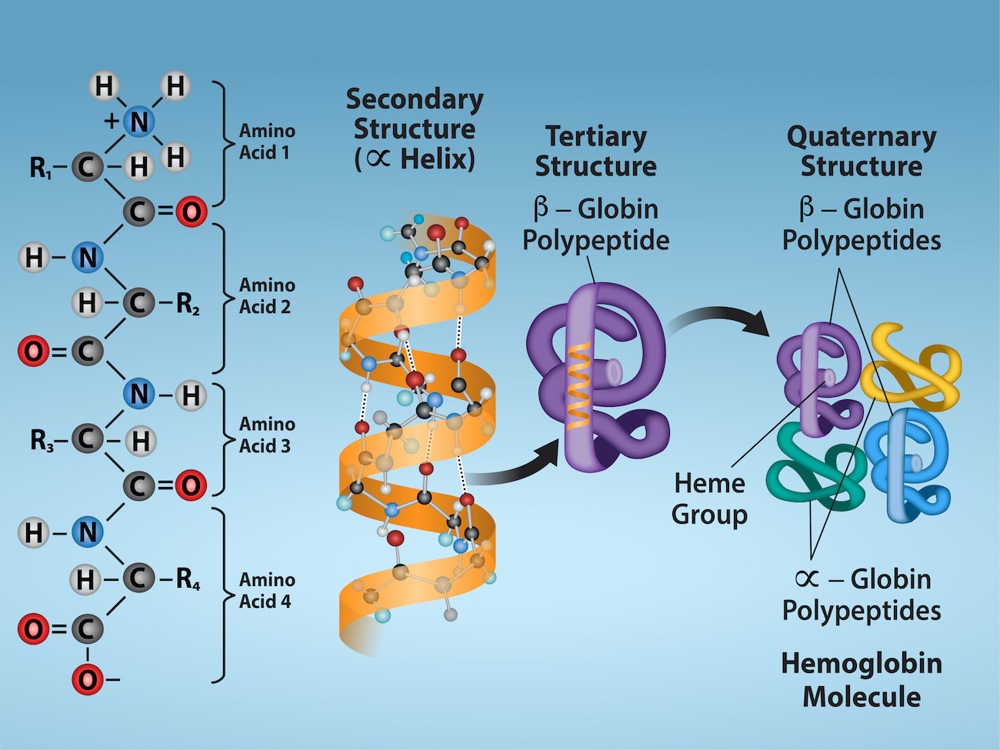
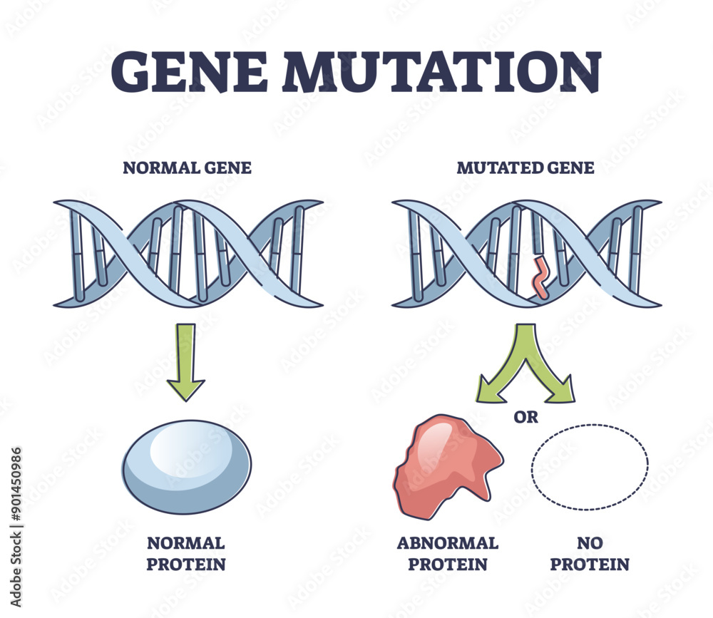

# A Theory Introduction to Proteins for Graph-Based Learning

## Glossary

| Term | Meaning in this project |
|---|---|
| **Amino acid** | One of the small molecules used as building blocks of proteins. The 20 standard amino acids have different chemical properties. |
| **Residue** | An amino acid after it has been incorporated into a protein chain. In our protein graphs, one residue is one node. |
| **Sequence** | The ordered list of residues in a protein, usually written with one-letter amino-acid codes such as `ACDEFG`. |
| **Protein structure / fold** | The three-dimensional shape adopted by a protein chain. Residues far apart in the sequence can be close together in the folded structure. |
| **Wild type (WT)** | The reference, unmodified version of a protein against which a mutant is compared. |
| **Mutation** | A change to a protein sequence. This project considers single-residue substitutions such as `E15Q`: glutamate (`E`) at position 15 is replaced by glutamine (`Q`). |
| **Mutant / variant** | A protein sequence containing a mutation relative to the wild type. |
| **Protein stability** | How strongly a protein favors its folded state over its unfolded state under specified conditions. |
| **$\Delta G$ (delta G)** | The free-energy difference between the folded and unfolded states of one protein. In this project's convention, a larger $\Delta G$ means greater stability. |
| **$\Delta\Delta G$ (delta-delta G, ddG)** | The change in stability caused by a mutation: $\Delta G_{\mathrm{mutant}}-\Delta G_{\mathrm{WT}}$. In the MegaScale data used here, a negative value means destabilisation. |
| **Protein graph** | A representation in which residues are nodes and edges connect residues related by spatial or structural proximity. |
| **Node / edge features** | Numerical information attached to graph nodes or edges, such as amino-acid identity, 3D distance, or sequence separation. |
| **Embedding** | A learned vector representation that summarizes useful properties of a residue, graph region, or complete protein. |
| **Graph neural network (GNN)** | A neural network that updates node representations by exchanging and aggregating information along graph edges. |
| **Label / target** | The value a supervised model is trained to predict. For MegaScale examples, the target is the measured $\Delta\Delta G$. |
| **Self-supervised learning** | Learning from patterns within the input itself rather than from human-provided labels. |
| **Pretraining** | Training an encoder on a broad initial task—in this project, learning from unlabelled SCOP structures—before training it for stability prediction. |
| **JEPA** | Joint-Embedding Predictive Architecture: a framework that learns by using visible context to predict the representation of hidden or masked input. |
| **Fine-tuning** | Continuing to train a pretrained model on the labelled downstream task, here mutation-effect prediction with MegaScale. |
| **Protein-disjoint split** | A train/validation/test division in which the same protein cannot occur in more than one split, providing a more honest test on unseen proteins. |

Proteins are the molecular machines of life. They catalyze reactions, transport molecules, transmit signals, and build the structural framework of cells. At the most basic level, a protein is a chain of amino acids linked together in a specific order. That order, together with the surrounding environment, determines how the protein folds into a three-dimensional shape, and that shape determines its function.

For machine learning, this makes proteins especially interesting: they are both biological objects and structured data. A protein can be viewed as a sequence, a 3D coordinate set, or, in our project, a graph.

## 1. Amino acids: the building blocks

Amino acids are the fundamental units of proteins. Each amino acid contains:

- a backbone shared by all amino acids,
- a central alpha carbon,
- and a side chain, often called the R-group.

The side chain is what makes amino acids different from one another. Some are hydrophobic, some polar, some charged, and some are chemically special because they can form strong interactions or rigid structures. This diversity is crucial: the identity of each amino acid affects how the chain folds and how the final protein behaves.

When amino acids are joined together, they form peptide bonds. The resulting chain is called a polypeptide, and a folded polypeptide is a protein. The sequence of amino acids is often called the primary structure of the protein.

## 2. Protein structure: from sequence to function

Proteins are not random strings of symbols; they are shaped objects with a hierarchy of structure:

- Primary structure: the amino acid sequence.
- Secondary structure: local patterns such as alpha helices and beta sheets.
- Tertiary structure: the full 3D arrangement of the chain.
- Quaternary structure: how multiple protein chains come together.

A single change in the amino acid sequence can alter the protein’s stability, its interaction partners, or even its function. This is why proteins are so sensitive to mutations.

## 3. Mutations: small changes with large effects

A mutation is a change in the amino acid sequence. The simplest kind is a point mutation, where one residue is replaced by another. Mutations can be harmless, slightly disruptive, or devastating depending on where they occur and what chemical properties the new amino acid introduces.

From a biological perspective, a mutation can affect:

- the local packing of the protein core,
- hydrogen bonding and electrostatic interactions,
- the stability of the folded state,
- and the ability of the protein to bind another molecule.

In our project, mutations are not just biological curiosities; they are the central supervision signal. The goal is to predict how much a mutation destabilizes a protein, often measured as a change in free energy, commonly written as $\Delta \Delta G$. A mutation that strongly destabilizes a protein may change its folding behavior or reduce its biological activity.

## 4. Protein stability, mutation measurements, and the data

### 4.1. What is protein stability?

A protein does not remain permanently folded. It fluctuates between a folded state, in which it can usually perform its biological function, and an unfolded state. **Protein stability** describes how strongly the folded state is favored over the unfolded state under a given set of conditions. It is determined by the combined effect of many interactions, including hydrophobic packing, hydrogen bonds, electrostatic interactions, and the entropy of the chain and surrounding solvent.

The difference in free energy between the folded and unfolded states is written as $\Delta G$. In the convention used by this project, a larger $\Delta G$ means that the folded state is more stable. Stability is not an absolute property: it can change with temperature, pH, salt concentration, and other experimental conditions.

### 4.2. How is the effect of a mutation measured?

To measure a mutation, researchers compare a mutant protein with its corresponding wild-type, or unmodified, protein. The change in stability is

$$
\Delta\Delta G = \Delta G_{\mathrm{mutant}} - \Delta G_{\mathrm{wild\ type}}.
$$

With the sign convention used in the MegaScale data and this project:

- $\Delta\Delta G > 0$ means the mutation is stabilizing,
- $\Delta\Delta G < 0$ means the mutation is destabilizing,
- and a value near zero means that the mutation has little measured effect on stability.

Sign conventions differ across publications, so the convention must always be checked before comparing datasets or models.

In the MegaScale experiments, many protein variants are exposed to proteases under controlled conditions. Unfolded or unstable proteins are generally easier for a protease to cut, whereas well-folded proteins are more resistant. Measurements across experimental conditions are used to infer folding stability and then calculate the difference between each mutant and its wild type. The resulting $\Delta\Delta G$ value is the supervised target predicted by the model.

A mutation such as `E15Q` records three pieces of information: the wild-type residue is glutamate (`E`), the affected position is 15, and the mutant residue is glutamine (`Q`). The model combines this mutation description with the residue's location and neighborhood in the wild-type structure.

### 4.3. Which data does this project use?

The project uses two complementary datasets:

| Dataset | Contents | Role in the project |
|---|---:|---|
| **SCOP** | 6,782 protein structures without stability labels | Self-supervised JEPA pretraining |
| **MegaScale** | 862 protein structures and 271,231 mutation-stability measurements | Supervised fine-tuning and evaluation |

SCOP teaches the encoder general structural patterns without requiring mutation labels. Each protein is converted into a residue graph, and the JEPA objective asks the model to predict representations of hidden regions from their visible structural context.

MegaScale supplies the downstream labels. Each example links a wild-type protein structure to a single-residue substitution and its measured $\Delta\Delta G$. Because many mutations belong to the same protein, the structure can be encoded once and used to score multiple mutations.

The train, validation, and test splits are **protein-disjoint**: a protein assigned to one split does not appear in either of the others. This is important because a random split over mutations could place mutations from the same protein in both training and testing, making performance look better without demonstrating that the model generalizes to unseen proteins.

## 5. Why proteins are interesting for machine learning

Proteins are challenging because they combine local detail with long-range dependence. A residue may interact with nearby residues in the chain, but also with residues far away in the sequence that become spatially close after folding. This makes them ideal test cases for models that can reason over structured relationships.

In programming, proteins can be represented in several ways:

- As strings of amino-acid letters, such as `ACDEFGH...`.
- As one-hot vectors, where each residue is encoded as a categorical variable.
- As learned embeddings, where each amino acid or residue is mapped to a dense vector.
- As graphs, where each amino acid is a node and edges connect residues that are close in space or structure.

The graph representation is especially relevant for this project. It mirrors the physical reality of proteins: residues are connected by local interactions, and the surrounding neighborhood strongly influences each residue’s role.

## 6. Protein representation in GNNs

Graph neural networks are a natural fit for proteins because a protein can be treated as a graph of residues. In this representation:

- nodes represent amino-acid residues,
- edges represent spatial or structural relationships between residues,
- node features can encode amino-acid identity, local geometry, or learned embeddings,
- edge features can encode distances, orientations, or neighborhood context.

This is powerful because the model can learn from both the identity of a residue and its position in the protein’s structural landscape. A mutation at one node can change the signal received by its neighbors, which in turn affects the representation of the whole protein.

In other words, graph-based models do not only see a sequence; they see a relational object. That is a much closer match to how proteins actually work.

## 7. Why JEPA is a good fit

The Joint-Embedding Predictive Architecture, or JEPA, is a self-supervised learning framework. Instead of requiring labels for every input, it learns by predicting missing or hidden parts of the data from the visible context. In a protein setting, this means a model can learn useful representations of structure without needing explicit supervision for every residue or mutation.

For our project, JEPA can be used in a simple and meaningful way:

- the model observes a partially masked protein graph,
- it builds an embedding of the visible structure,
- and it learns to predict the embedding of the missing or hidden information.

This is especially relevant for proteins because many properties of interest, such as stability or folding behavior, are only indirectly observable. Self-supervised pretraining lets the model discover structure-sensitive features before it is fine-tuned for a downstream task such as mutation effect prediction.

## 8. Connection to this project

In this project, we combine these ideas in a single pipeline:

1. represent proteins as graphs,
2. use graph neural networks to encode residue-level and structure-level information,
3. pretrain with a JEPA-style objective that learns meaningful representations without labels,
4. and fine-tune the model to predict how mutations affect protein stability.

That is why proteins are such a strong testbed for modern representation learning. They are structured, relational, biologically meaningful, and scientifically important. They also provide a natural bridge between biology and machine learning: a protein is both a living system and a graph.

The central challenge is to learn representations that capture the subtle relationship between sequence, structure, mutation, and function. That is exactly the kind of problem that graph neural networks and JEPA are well suited to address.
